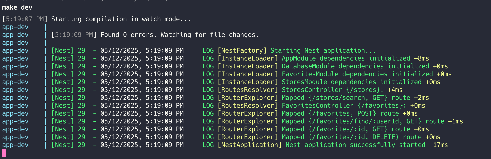
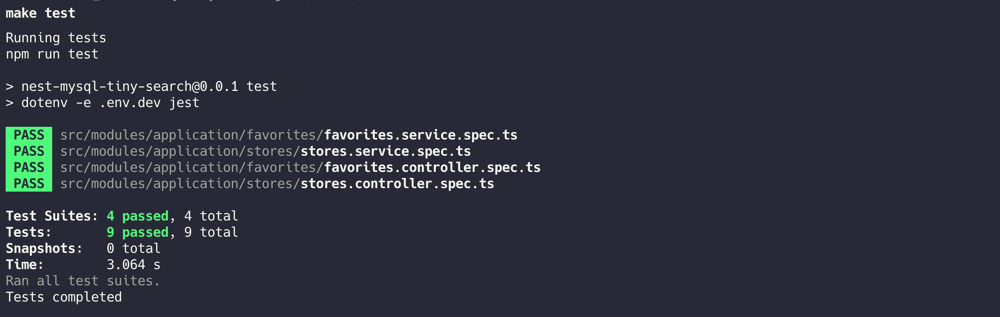

# Tiny search engine
A repo for a tiny search engine
# How to run
1. Clone the repo
```bash
git clone https://github.com/henrynguyen6677/rw-tiny-search.git
```
2. Set up the environment on your local machine
```bash
cd rw-tiny-search
cp .env.example .env.dev
```
3. Run dev
```
make lazy-dev
```


4. Run the tests
```bash
make test
```


Video:
[](https://asciinema.org/a/3U2iOHvgKySVVb0lyPBVhTwIO)


# Swagger UI
You can access the Swagger UI at `http://localhost:3000/api` to see the API documentation and test the endpoints.

