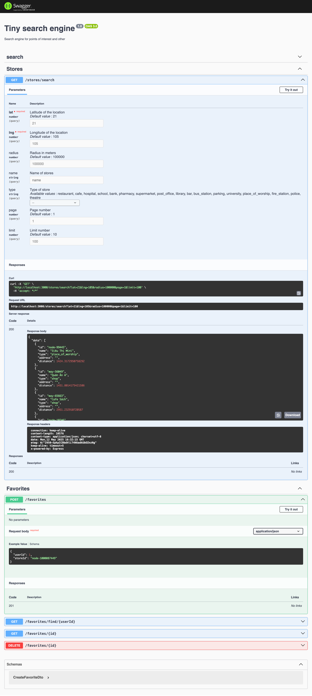

# Tiny search engine
A repo for a tiny search engine
# How to run
1. Clone the repo
```bash
git clone https://github.com/henrynguyen6677/rw-tiny-search.git
```
2. Set up the environment on your local machine
```bash
cd rw-tiny-search
cp .env.example .env.dev
```
3. Install dependencies
```bash
make install
```
4. Set up the database for development
```bash
make migrate-dev
```
5. Seed the database
```bash
make seed
```
6.Run the app
```bash
make dev
```

7. Run the tests
```bash
make test
```

# Swagger UI
You can access the Swagger UI at `http://localhost:3000/api` to see the API documentation and test the endpoints.

